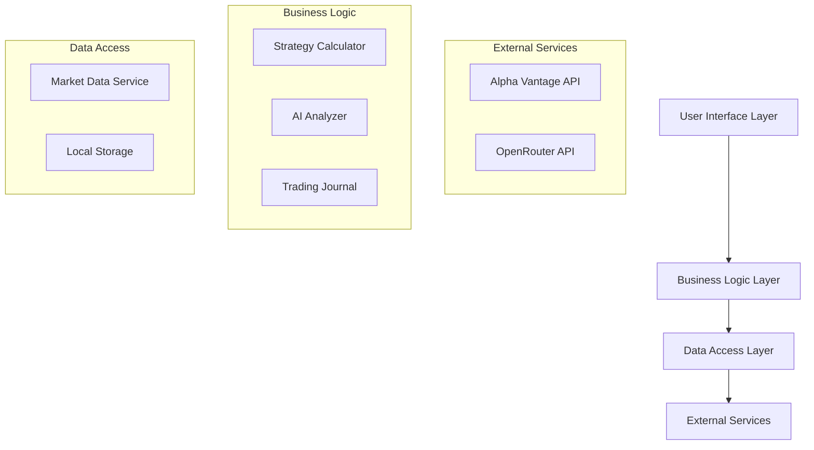

# Design Document

## Overview

The AI Options Strategy Analyzer is a Python-based desktop application that provides options traders with strategy analysis capabilities. The system integrates with Alpha Vantage API for market data, uses OpenRouter for AI analysis, and provides a local interface for strategy construction and paper trading journal management.

The architecture follows a modular design with clear separation between data access, business logic, and presentation layers. The MVP focuses on two-leg options spreads with immediate calculation feedback and AI-powered insights.

## Architecture

### High-Level Architecture



### Technology Stack

- **Backend:** Python 3.11+
- **Package Management:** uv for dependency and virtual environment management
- **HTTP Client:** httpx for async API calls
- **Data Processing:** pandas for options chain manipulation
- **Visualization:** matplotlib for payoff diagrams
- **UI Framework:** Streamlit for rapid MVP development
- **Local Storage:** SQLite for trading journal persistence
- **Configuration:** python-dotenv for API key management

## Components and Interfaces

### 1. Market Data Service (`market_data.py`)

**Purpose:** Handle all external API interactions for stock quotes and options data.

**Key Methods:**
- `get_stock_quote(symbol: str) -> StockQuote`
- `get_options_chain(symbol: str, expiration: str) -> OptionsChain`
- `validate_api_connection() -> bool`

**Error Handling:**
- API rate limiting with exponential backoff
- Connection timeout handling
- Invalid symbol/expiration validation

### 2. Strategy Calculator (`strategy_calculator.py`)

**Purpose:** Core financial calculations for options strategies.

**Key Methods:**
- `calculate_net_premium(legs: List[OptionLeg]) -> float`
- `calculate_max_profit(strategy: Strategy) -> float`
- `calculate_max_loss(strategy: Strategy) -> float`
- `calculate_breakeven_points(strategy: Strategy) -> List[float]`
- `calculate_margin_requirement(strategy: Strategy) -> float`
- `generate_payoff_diagram(strategy: Strategy) -> PayoffData`

**Financial Formulas:**
- Net Premium: Sum of (Action × Premium) for each leg
- Max Profit/Loss: Based on strategy type and strike differences
- Breakeven: Solve for stock price where payoff = 0
- Margin: Max loss for credit spreads, net premium for debit spreads

### 3. AI Analyzer (`ai_analyzer.py`)

**Purpose:** Interface with OpenRouter API for strategy analysis.

**Key Methods:**
- `analyze_strategy(strategy: Strategy, stock_data: StockQuote) -> AIAnalysis`
- `format_analysis_prompt(strategy: Strategy, stock_data: StockQuote) -> str`

**Analysis Structure:**
- Strategy Interpretation: One-sentence strategy identification
- Market Outlook: Implied directional bias and profit conditions
- Risk Assessment: Key risk scenarios and loss conditions

### 4. Trading Journal (`trading_journal.py`)

**Purpose:** Manage paper trading records and performance tracking.

**Key Methods:**
- `save_trade(strategy: Strategy) -> TradeRecord`
- `get_all_trades() -> List[TradeRecord]`
- `close_trade(trade_id: int, closing_data: ClosingData) -> TradeRecord`
- `calculate_final_pnl(trade: TradeRecord, closing_data: ClosingData) -> float`

### 5. Command Line Interface (`cli.py`) - Milestone 1

**Purpose:** Terminal-based interface for core functionality validation and user feedback.

**Key Commands:**
- `get-quote <symbol>`: Display current stock price
- `get-options <symbol> <expiration>`: Show options chain
- `build-strategy`: Interactive strategy builder
- `analyze-strategy`: Get AI analysis of current strategy
- `save-trade`: Save strategy to journal
- `list-trades`: Display trading journal
- `close-trade <id>`: Close a position

### 6. Web User Interface (`app.py`) - Milestone 2

**Purpose:** Streamlit-based web interface for enhanced user experience.

**Key Components:**
- Stock selection and quote display
- Options chain data table
- Strategy builder with leg configuration
- Real-time metric calculations display
- Payoff diagram visualization
- AI analysis panel
- Trading journal management

## Data Models

### Core Data Structures

```python
@dataclass
class StockQuote:
    symbol: str
    price: float
    timestamp: datetime
    
@dataclass
class OptionContract:
    symbol: str
    strike: float
    expiration: date
    option_type: str  # 'call' or 'put'
    bid: float
    ask: float
    
@dataclass
class OptionLeg:
    action: str  # 'buy' or 'sell'
    contract: OptionContract
    quantity: int = 1
    
@dataclass
class Strategy:
    legs: List[OptionLeg]
    underlying_symbol: str
    created_at: datetime
    
@dataclass
class StrategyMetrics:
    net_premium: float
    max_profit: float
    max_loss: float
    breakeven_points: List[float]
    margin_requirement: float
    return_on_margin: float
    
@dataclass
class TradeRecord:
    id: int
    strategy: Strategy
    metrics: StrategyMetrics
    entry_date: date
    status: str  # 'open' or 'closed'
    closing_price: Optional[float] = None
    final_pnl: Optional[float] = None
```

## Error Handling

### API Error Management
- **Rate Limiting:** Implement exponential backoff for Alpha Vantage API limits
- **Network Errors:** Retry logic with circuit breaker pattern
- **Invalid Data:** Validation for stock symbols and expiration dates
- **Authentication:** Clear error messages for invalid API keys

### Calculation Error Handling
- **Invalid Strategies:** Validate leg combinations before calculations
- **Division by Zero:** Handle edge cases in margin calculations
- **Data Inconsistencies:** Validate bid/ask spreads and option chain data

### User Input Validation
- **Strike Price Validation:** Ensure strikes exist in options chain
- **Expiration Date Validation:** Verify dates are in the future
- **Quantity Limits:** Enforce reasonable position sizes for MVP

## Testing Strategy

### Unit Testing
- **Strategy Calculator:** Test all financial formulas with known inputs/outputs
- **Market Data Service:** Mock API responses for consistent testing
- **AI Analyzer:** Test prompt formatting and response parsing
- **Trading Journal:** Test CRUD operations and data persistence

### Integration Testing
- **API Integration:** Test with Alpha Vantage sandbox/demo data
- **End-to-End Workflows:** Complete strategy creation to journal saving
- **Error Scenarios:** Test API failures and recovery mechanisms

### Test Data Management
- **Mock Options Chains:** Predefined data for consistent testing
- **Sample Strategies:** Common spread types for validation
- **Edge Cases:** Extreme strike prices and expiration dates

## Configuration and Deployment

### Environment Configuration
- **API Keys:** Stored in `.env` file (not committed to version control)
- **Default Settings:** Configurable stock symbols list, API timeouts
- **Database:** SQLite file location and schema management

### Local Development Setup
1. Clone repository
2. Install uv package manager
3. Create virtual environment: `uv venv`
4. Install dependencies: `uv pip install -r requirements.txt`
5. Configure API keys in `.env` file
6. **Milestone 1:** Run CLI: `python cli.py`
7. **Milestone 2:** Run web app: `streamlit run app.py`

### MVP Limitations and Future Considerations
- **Single User:** No authentication or multi-user support
- **Local Storage:** SQLite database, no cloud synchronization
- **Limited Strategies:** Two-leg spreads only
- **Manual Position Management:** No automated expiration handling
- **Basic UI:** Streamlit interface suitable for MVP validation